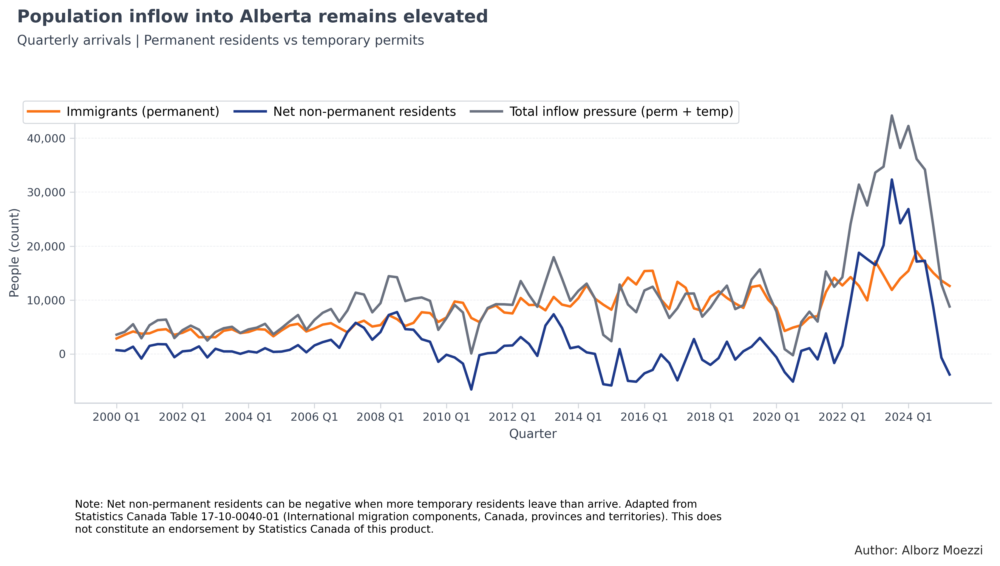
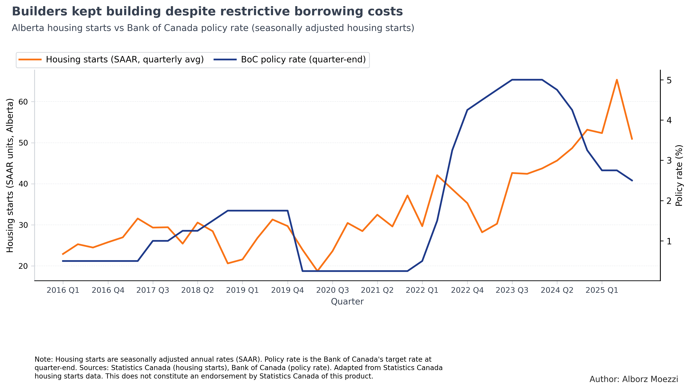
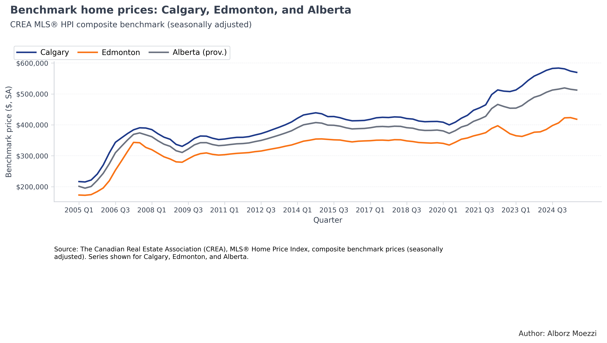
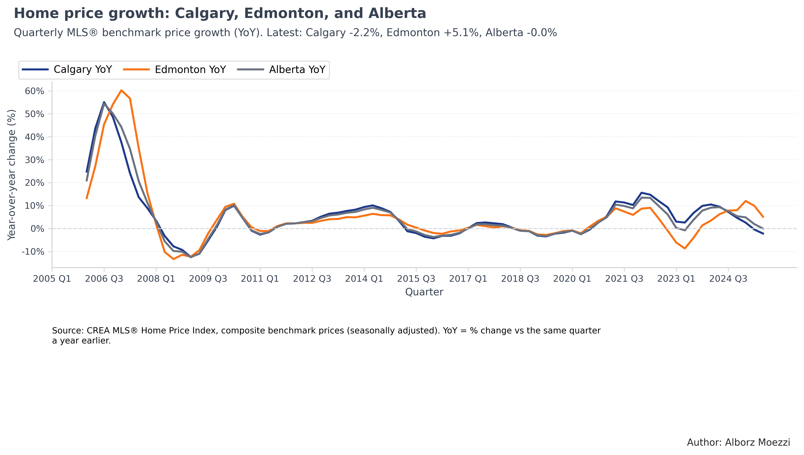
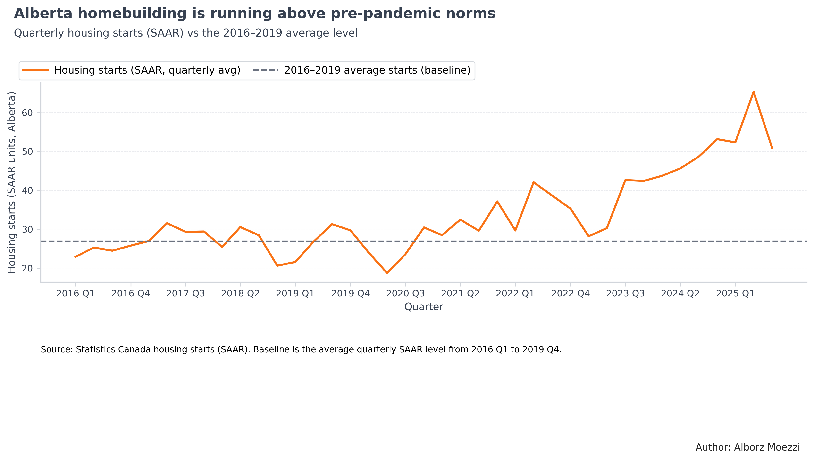

# Alberta Housing & Migration Analysis

Clean, reproducible pipeline and figures for Alberta’s housing pressure story:
- Bank of Canada policy rate (daily → month/quarter end)
- Housing starts (SAAR) for Alberta (monthly → quarterly mean)
- International migration components (immigrants, net NPR, net emigration)
- Interprovincial migration (in, out, net)
- CREA MLS® HPI (monthly → quarterly)

## Repository layout
data/
raw/ # upload input files here (CSV/XLSX)
processed/ # generated by the pipeline
figures/ # generated charts (PNG/PDF)
logs/
notebooks/
scripts/
run_pipeline.py
make_figures.py
src/
ab_housing/
init.py
cleaning.py
plotting.py
docs/

sql
Copy code

## Quick start (local)
1. Create a virtual environment and install dependencies:
pip install -r requirements.txt

markdown
Copy code
2. Place raw input files in `data/raw/` with these names:
- `Canadian Policy Rate BoC.csv`
- `housing starts statcan.csv`
- `Alberta_international_migration_quarterly_clean.csv`
- `MLS HPI SA.xlsx`
- `Interprovincial migration.csv`
3. Run the cleaners:
python scripts/run_pipeline.py

markdown
Copy code
Outputs will be written to `data/processed/`.
4. Build figures:
python scripts/make_figures.py

markdown
Copy code
Figures will be in `figures/`.

## Notes
- Paths are relative to the repository root (no machine-specific paths).

- ## Results

- 📄 **Full report (PDF):**
  [Download the final report](docs/alberta-housing-2025.pdf)

### Key Figures

**Figure 1. Population inflow into Alberta remains elevated**  

**Figure 2. Builders kept building despite restrictive borrowing costs**  

**Figure 3. Benchmark home prices: Calgary, Edmonton, and Alberta**  

**Figure 4. Home price growth: Calgary, Edmonton, and Alberta**  

**Figure 5. Alberta homebuilding is running above pre-pandemic norms**  

